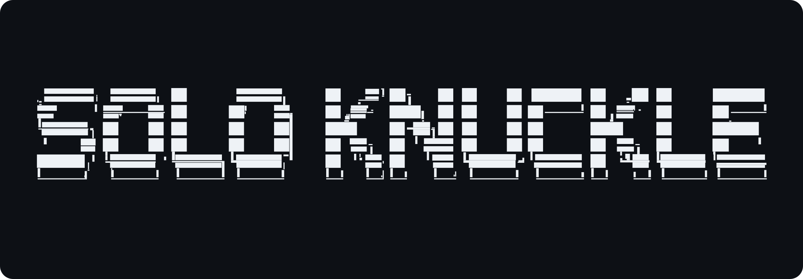

# Soloknuckle — Production Hygiene for AI-Assisted Development

<p align="center">
  
</p>

<p align="center">
  <a href="https://github.com/soch-ship-it/soloknuckle/actions/workflows/ci.yml"></a>
  <a href="https://www.npmjs.com/package/soloknuckle"></a>
  <a href="https://www.npmjs.com/package/soloknuckle"></a>
  
  
  <a href="./LICENSE"></a>
  = 20">
</p>

**Every security tool tells *people* to be more careful. Soloknuckle is the one that makes the *AI writing your code* be careful — not by asking, but by handing it a veto it cannot argue with.**

Its moat isn't one scanner; it's a system purpose-built for the era it serves:

- **It targets AI's exact failure modes — the ones linters and CVE scanners were never designed for.** Same-model blindness (one model writes the code *and* the tests that rubber-stamp it), truthy coverage (100% line coverage that detects 4% of bugs), leaked credentials inside agent-generated diffs, `rm -rf` in a "helpful" shell step, a $-priced flaky-suite tax nobody else even measures. These are the failure patterns of AI-assisted development, and they're what Soloknuckle is engineered around.
- **It turns guardrails into a contract instead of a suggestion.** Every check returns a machine-readable verdict the model must obey: `soloknuckle_secrets` → `{ clean: false, violations: [...] }`, `soloknuckle_intercept` → `{ blocked: true, reason }`. The agent doesn't *remember* to check — it *calls a tool* and gets an answer it can't talk its way out of. That is a moat: docs go stale, enforced call-sites don't.
- **One engine, every surface — one source of truth.** The same firewall, scanner, and scorer run in your CLI, your CI gate, your git hooks, your shell, your webhook rollback daemon, and your agent's MCP tools. "Ready to ship" means one thing on every machine, verified locally, never phoning home.

And it ships the way a moat is meant to ship: **free, open source, zero config, under two minutes** — platform-team-grade infrastructure as a single `npx soloknuckle init`, proven on itself (494 tests, 94/100 self-score, 11/11 self-compliance).

---

## Table of Contents

- [The Problem](#the-problem)
- [What It Is — The Product](#what-it-is--the-product)
- [Why It Matters — The Value](#why-it-matters--the-value)
- [One Standard. Everywhere.](#one-standard-everywhere)
- [Quick Start](#quick-start)
- [MCP Server for AI Agents](#mcp-server-for-ai-agents)
- [7-Domain Scorecard](#7-domain-scorecard)
- [Hard Gates (`--strict`)](#hard-gates--strict)
- [Commands Reference](#commands-reference)
- [IDE Integration](#ide-integration)
- [LLM Configuration (Optional)](#llm-configuration-optional)
- [Security & Package Integrity](#security--package-integrity)
- [What Soloknuckle Does NOT Do](#what-soloknuckle-does-not-do)
- [Who Is It For](#who-is-it-for)
- [Architecture & Project Structure](#architecture--project-structure)
- [Testing](#testing)
- [Updating](#updating)
- [Contributing](#contributing)
- [FAQ](#faq)
- [License](#license)

---

## The Problem

AI coding agents write code faster than any human team ever has — and they fail in patterns humans rarely do. The failures are cheap to make and expensive to ship:

| Failure mode | What it looks like | What it costs |
|---|---|---|
| **Credential leakage** | An API key or AWS secret committed in a generated diff | The breach, the blast radius, the incident postmortem |
| **Destructive commands** | `rm -rf` or `git push --force` in a "helpful" shell step | Hours of work or the entire filesystem |
| **Coverage illusions** | "100% line coverage" that detects 4% of bugs | Real regressions shipped with a green badge |
| **Same-model blindness** | AI writes the tests *and* the code — wrong in the same direction, so tests never catch the bug | Flaws that pass CI and fail in production |
| **Flaky suites** | Tests that pass sometimes, fail randomly, get ignored forever | An estimated **~$360k/month** in manual triage for a large flaky suite |
| **Unknown authorship** | Nobody can answer "how much of this codebase is AI-written?" | You can't audit, attribute, or manage what you can't measure |
| **Supply-chain compromise** | A typosquatted or dormant-package dependency installs a hostile script | The modern version of the 2021 npm OSS attacks — inside your lockfile |
| **Manual, late rollbacks** | A bad merge lives in prod for hours while a human checks dashboards | Downtime, lost trust, lost revenue |

Linters check style. Snyk checks CVEs. Neither one protects you from failure modes **specific to AI-assisted development** — because neither one was built for it. Soloknuckle was.

---

## What It Is — The Product

One command. Zero config. No API key. Every check runs **locally**, on **Node.js 20+**, in under two minutes.

| Capability | What it means in practice | Structure |
|---|---|---|
| **Secret scanning** | Scans staged code and diffs for API keys, tokens, and PII before commit/push | Engine: `scanner.ts` |
| **Command firewall** | Blocks destructive patterns — `rm -rf`, `git push --force`, `chmod 777`, `curl \| sh`, SQL drops — before they execute, with a machine-readable reason | Engine: `interceptor.ts` |
| **Mutation testing gate** | Breaks your code on purpose (5 mutation types — operator, return, boundary, boolean, string), then checks whether your tests notice. Exposes "100% coverage, 4% bug detection" | Engine: `mutation.ts` |
| **Context-aware test validator** | Detects same-model blindness: tests with no assertions, hardcoded values, missing mocks, real network calls | Engine: `context-validator.ts` |
| **Caller contract checker** | Validates that test calls match real signatures — parameter counts, types, return types | Engine: `caller-contract.ts` |
| **Flaky test detector** | Finds flaky patterns (`setTimeout`, `Math.random`, `Date`, network), re-runs to catch intermittents, and prices the maintenance cost | Engine: `flaky-detector.ts` |
| **AI vs human telemetry** | Tracks how much of your codebase is AI-authored, per week, and flags repeat-offender patterns | Engine: `telemetry.ts` |
| **Supply-chain sentinel** | Behavioral dependency scan: dormant packages with sudden updates, new lifecycle scripts, typosquatting patterns, untrusted publishers + `npm audit` (`quick` → `standard` → `deep`) | Engine: `supply-chain-sentinel.ts` |
| **AI commit watcher** | Tracks AI-authored commits, quarantines risky ones, creates approval branches | Engine: `ai-watcher.ts` |
| **Auto-rollback daemon** | Signed webhooks (Sentry, GitHub, generic) that flip a feature flag or revert the AI culprit automatically | Engine: `rollback.ts` |
| **Feature flags** | Versioned `flags.json` + 9-tool MCP control from chat | Engine: `check.ts` + `mcp-server.ts` + `rollback.ts` |
| **SBOM + compliance** | CycloneDX manifests + an 11-check self-audit against Soloknuckle's own standards | Engine: `sbom.ts`, `compliance.ts` |

That's **13 scoring dimensions across 7 domains**, **29 test suites (494 tests)** proving the product on itself, and **11/11 compliance checks passing on the repo you're reading right now**.

And the whole thing is a single surface that speaks your stack's language:

```
YOU write:    npx soloknuckle check --strict     → your CI blocks the merge
YOUR AGENT:   soloknuckle_score / intercept      → MCP tool, native tool-calling
YOUR SHELL:   npx soloknuckle intercept rm -rf x → exit 1, reason returned
YOUR WATCHER: POST /webhooks/sentry              → HMAC-signed auto-revert
YOUR GATES:   git hooks, AGENTS.md, IDE rules    → scaffolded by `init`
```

---

## Why It Matters — The Value

This is not a linter with a nicer logo. It is the **quality infrastructure of an AI-native engineering org**, delivered in one command:

- **It catches what coverage cannot.** 100% line coverage can mean 4% bug detection. Mutation scoring (bounded: ≤10 mutations, ≤2 re-runs, <2 min CI impact) proves your tests validate *behavior*, not execution.
- **It prices the problem.** The flaky-detector estimates the monthly cost of a flaky suite (~$360k/month at scale) so engineering leaders can defend the investment in dollars, not vibes.
- **It protects survivability, not just style.** Secrets and destructive commands are existential failures, not style failures — name one other tool that blocks `rm -rf` *before* it runs and then tells the model *why*.
- **It audits the machine.** AI-vs-human telemetry turns "how much of this is AI?" from a guess into a weekly, attributable number.
- **It rolls back automatically.** A signed webhook flips a flag or reverts the AI culprit — rollback becomes a reflex, not a fire drill.
- **It's the same standard everywhere.** CLI, CI gate, MCP tool, shell guard, and webhook all run the *same engine* on the *same machine* — so an agent and a human can never disagree on "ready to ship."
- **It's free.** The platform-team depth runs locally, open source (ISC). The only optional costs are cloud LLM keys you bring for `audit`/`pr` — or a local Ollama at $0.

**Proof it works:** this repository scores **94/100** under its own seven-domain scorecard, passes **11/11** of its own compliance checks, ships **494 tests**, and — like every release — was published only with the owner's two-factor authentication.

---

## One Standard. Everywhere.

The embarrassing problem with most guardrail tools: the agent in your IDE, the CI pipeline, and the security script live in different worlds and silently disagree. Soloknuckle collapses them into one engine:

| Surface | How it's activated | What happens |
|---|---|---|
| **Terminal** | `npx soloknuckle check` | Pre-flight score + gate report |
| **CI / merge** | `npx soloknuckle check --strict` | Exit code 1 blocks the merge (four gates + four analyzers) |
| **AI agent** | `soloknuckle_*` MCP tools | The agent *calls* the check and obeys the verdict |
| **Git hooks** | `init`-scaffolded pre-commit / commit-msg | Secrets and dangerous commands die before commit |
| **Shell** | `guard-install` | zsh/bash wrappers for `rm`/`git`/`chmod`/`dd`/`curl`/`wget` |
| **Runtime** | `watch` webhook daemon | Signed events auto-revert failures in production |

---

## Quick Start

```bash
# 1. Initialize (scaffolds git hooks, AGENTS.md, IDE rules)
cd your-project
npx soloknuckle init

# 2. Run pre-flight checks before pushing
npx soloknuckle check

# 3. Enforce hard gates in CI (exits non-zero on failure)
npx soloknuckle check --strict
```

Requires Node.js ≥ 20. No account, no API key, no config.

**Add to CI (one line):**

```yaml
- run: npx soloknuckle check --strict
```

Merges that fail the [hard gates](#hard-gates--strict) are blocked automatically.

---

## MCP Server for AI Agents

Here's the part we're most excited about — and the one that genuinely changes how your AI teammate behaves.

**Soloknuckle is a hygiene layer that speaks the agents' native protocol.** Instead of hoping your coding agent *remembers* to be careful, you hand it direct, callable **tools** it must use before it ships. The agent doesn't read a blog post about secret scanning — it *calls* `soloknuckle_secrets` and gets a verdict. It doesn't guess whether `rm -rf` is safe — it calls `soloknuckle_intercept` and the firewall answers.

Through the [Model Context Protocol](https://modelcontextprotocol.io), every flagship Soloknuckle capability becomes a first-class tool any MCP client can invoke: Claude Desktop, Cursor, Windsurf, GitHub Copilot, Codex, Gemini CLI, Replit Agent, Lovable, and every agent that speaks stdio MCP.

No accounts. No API keys. No server to host. One `npx`, one JSON block, done — and it all runs locally on your machine.

### Install in 30 seconds

Add this block to your MCP client's config (Claude Desktop → *Settings → Developer → Edit Config*; Cursor → *Settings → MCP*):

```json
{
  "mcpServers": {
    "soloknuckle": {
      "command": "npx",
      "args": ["soloknuckle-mcp"]
    }
  }
}
```

That spawns the **exact same engine as the terminal CLI** — same scorer, same scanner, same firewall. An agent and a human can never disagree on what "ready to ship" means, because they read the same numbers off the same machine.

Prefer a locally installed binary (fastest startup, fully offline):

```bash
npm install -g soloknuckle
# then use:  "command": "soloknuckle-mcp"
```

And `npx soloknuckle init` auto-detects your editor and scaffolds `mcp-config.json` + `SKILL.md` for the agents you actually use — including a universal prompt that tells the agent to read `AGENTS.md` and run `npx soloknuckle check` before it finishes any task.

### The 9 tools your agent gets

| Tool | Args | What it returns | Call it when |
|------|------|-----------------|--------------|
| `soloknuckle_score` | — | Hygiene score 0–100: overall + quality, testing, security, efficiency, accessibility, with per-dimension raw evidence | **At the start and before a commit** — never let the agent ship a score below gate |
| `soloknuckle_intercept` | `command` | Firewall verdict `{ blocked, reason }` for destructive patterns (`rm -rf`, `chmod 777`, `curl \| sh`, `git push --force`, SQL drops…) | **Before any destructive-looking shell command** — the cheapest "no" you'll ever get |
| `soloknuckle_secrets` | `diff` (empty = git diff) | `{ clean, violations[] }` — API keys, tokens, PII found in the diff | **Right before commit** — catches staged `ghp_…`, AWS keys, emails |
| `soloknuckle_telemetry` | — | AI vs human share of commits and lines | **After big sessions** — know exactly how much of the codebase is yours |
| `soloknuckle_flags` | — | The current `flags.json` — which features are off/on/allowlisted | **Before enabling anything in production** |
| `soloknuckle_flag_set` | `name`, `enabled` | Flips a flag in `flags.json` (the **only** file MCP can write) | **Rollback / gradual rollout from chat** |
| `soloknuckle_supply_chain_sentinel` | `depth: quick\|standard\|deep` | Behavioral supply-chain scan — dormant packages, lifecycle scripts, typosquats, untrusted publishers + `npm audit` | **Before adding any dependency** |
| `soloknuckle_suggest` | — | An LLM-generated improvement plan (requires a configured provider) | **After a low score** — close the loop |
| `soloknuckle_branches` | — | Local branches + which one is checked out | **Orientation** — the agent always knows where it is |

Every tool answers in clean, actionable JSON. Verdicts, not vibes.

### Watch it work — a real session

Here's what your agent actually looks like when Soloknuckle is wired in. You can replay this exact conversation in Claude Desktop today:

```
Agent:  "Cleaning up the temp directory now."
Agent:  → soloknuckle_intercept { "command": "rm -rf /tmp/build" }
Server: → { "blocked": true, "reason": "Blocked: 'rm -rf' matches destructive pattern" }
Agent:  "Blocked — fair. Let me do the same thing the safe way instead."
Agent:  → soloknuckle_intercept { "command": "find /tmp/build -type f -delete && rm -r /tmp/build" }
Server: → { "blocked": false, "reason": null }
Agent:  "Approved. Now checking where I stand."
Agent:  → soloknuckle_score
Server: → { "overall": 94, "quality": 85, "testing": 100, "security": 100, ... }
Agent:  "Green. Let me look at what's actually staged before committing."
Agent:  → soloknuckle_secrets { "diff": "" }
Server: → { "clean": false, "violations": ["Line 5: Potential secret (API key pattern) detected"] }
Agent:  "Found a leaked credential in the staged diff. Rotating it and scrubbing the file before commit."
Agent:  → soloknuckle_secrets { "diff": "" }
Server: → { "clean": true, "violations": [] }
Agent:  "Clean. Committing."
```

Without MCP this is a *hope*: "the agent will be careful." With MCP it's a *contract*: the agent calls the tool, and the tool tells it no.

### Security & limits (honest section)

- **Runs in your project directory only** — reads your git state, `package.json`, lockfiles, `flags.json`.
- **Ships zero bytes to the internet** unless you explicitly call `soloknuckle_suggest` with a configured cloud LLM. Intercept, secrets, score, telemetry, flags, sentinel: all local.
- **One writable file, and only one:** `flag_set` may update `flags.json`. Nothing else is ever written.
- **A veto, not a suggestion** — `blocked: true` is machine-readable and absolute; a well-configured agent treats it as a hard stop.
- Missing a client? It's stdio MCP (JSON-RPC 2.0, protocol `2024-11-05`) — if your agent can run a local command, it can speak to Soloknuckle.

---

## 7-Domain Scorecard

**Measured on this repository — today:**

```
┌────────────────────────────────────────────────────────┐
│  7-Domain Scorecard                                    │
│                                                        │
│  Code Quality             85  ██████████████░░         │
│  Testing                 100  ████████████████         │
│  Security & Compliance   100  ████████████████         │
│  Performance             100  ████████████████         │
│  Reliability             100  ████████████████         │
│  Dependencies & Supply Chain 78  ████████████░░░░      │
│  Documentation & Visibility 91  ███████████████░       │
│                                                        │
│  Overall: 94/100 — Production Ready ✓                  │
└────────────────────────────────────────────────────────┘
```

| Domain | What It Checks | Weight |
|--------|----------------|--------|
| **Code Quality** | Linting, formatting, TypeScript, complexity | 20% |
| **Testing** | Unit tests, E2E tests, coverage | 20% |
| **Security & Compliance** | Secrets, vulnerabilities, auth patterns | 20% |
| **Performance** | Bundle size, lazy loading, optimization | 10% |
| **Reliability** | Error tracking, retries, health checks | 10% |
| **Dependencies & Supply Chain** | Lockfiles, pinned deps, SBOM | 10% |
| **Documentation & Visibility** | README, CHANGELOG, LICENSE | 10% |

---

## Hard Gates (`--strict`)

| Gate | Minimum Score | Why It Matters |
|------|---------------|----------------|
| Security | ≥ 70 | No secrets, no critical vulnerabilities |
| Testing | ≥ 70 | Adequate test coverage and quality |
| Reliability | ≥ 60 | Error handling, health checks present |
| Supply Chain | ≥ 50 | Dependencies pinned, lockfile present |

If any gate fails, the command exits with code 1 — perfect for CI/CD pipelines.

In addition to the four metric gates, `--strict` runs **test-quality analyzers** after the metric gates pass: *Caller Contract*, *Context Validation*, *Flaky Detection*, and *Mutation Score*. Each must also score ≥ 70 to pass. These are heavier (they spawn the project test suite) and only execute when the metric gates are green, so non-strict runs stay fast.

---

## Commands Reference

### Core Commands (free, no API key)

| Command | Description | Output |
|---------|-------------|--------|
| `npx soloknuckle init` | Scaffolds AGENTS.md, git hooks, IDE rules (only for detected editors; `--all-ides` forces all) | Files created in project |
| `npx soloknuckle check` | Pre-flight: lint, test, typecheck, secret scan | Score report |
| `npx soloknuckle check --fix` | Auto-fix issues (lint, tests, deps, git, CI, docs, supply chain, reliability) | Fixes applied |
| `npx soloknuckle check --strict` | Enforce hard gates (exit code 1 on failure) | Pass/Fail per gate |
| `npx soloknuckle score` | Project health 0–100 across 7 domains (`--suggest` appends AI suggestions, requires an LLM provider) | 7-domain scorecard |
| `npx soloknuckle sbom` | Generate CycloneDX SBOM manifest | JSON SBOM file |
| `npx soloknuckle compliance` | Self-audit against Soloknuckle's own standards (11 checks, incl. committed-`.env` detection) | Compliance report |
| `npx soloknuckle telemetry` | AI vs human contribution stats | Stats report |
| `npx soloknuckle ai-watch [count]` | Track AI-authored commits, quarantine risky ones, and create approval branches (`--all` watches last 10; `--mark <sha>:<ai\|human>` applies a manual override) | Quarantine/approval branch |
| `npx soloknuckle intercept <command...>` | Evaluate a shell command against the firewall; exits 1 when destructive (`--json` for machine output). Powers the optional shell guard and raw-terminal protection | Allowed / blocked + reason |
| `npx soloknuckle guard-install` | Install the optional shell guard into `~/.zshrc` or `~/.bashrc` so raw terminals are firewall-protected too (`--shell bash\|zsh`, `--remove` to uninstall) | Shell config updated |
| `npx soloknuckle persona <type> <folder>` | Agent rules for specific directories (text; `-f json` for a manifest) | Persona files or JSON |
| `npx soloknuckle capabilities` | Command registry for AI agents (`-f text`, default, or `-f json`) | Text list or JSON |
| `npx soloknuckle watch` | Rollback daemon + webhook listener | Daemon process |

### LLM Commands (require an API key or Ollama)

| Command | Description | Cost |
|---------|-------------|------|
| `npx soloknuckle audit` | LLM reviews your uncommitted code | Free (Ollama) or API |
| `npx soloknuckle pr` | Auto-generates PR description from git diff | Free (Ollama) or API |

On the first LLM-command run, Soloknuckle asks for a provider and key (or local Ollama). On macOS the key is stored in the **system Keychain** (`~/.soloknuckle/config.json` holds only a reference); elsewhere it falls back to a `0600`-permissioned config file. Either way it is local only, never uploaded.

---

## IDE Integration

`npx soloknuckle init` detects which agent/editor is actually present in your project and only scaffolds files for the ones you use. Run with `--all-ides` to force the full set. If no IDE is detected, the defaults are scaffolded so a fresh project is immediately agent-ready.

| IDE | File Created | Setup Required |
|-----|--------------|----------------|
| **Cursor** | `.cursorrules` | None — auto-detected |
| **Windsurf** | `.windsurfrules` | None — auto-detected |
| **Claude Code / Gemini CLI** | `SKILL.md` | None — auto-detected |
| **Codex / Lovable / Claude Desktop** | `mcp-config.json` | Import MCP config in settings |
| **Replit** | `.replit` | None — default run command set |
| **Any other IDE** | Paste prompt in chat | See below |

If the project isn't a git repository, `init` prints a warning and skips hook installation until `git init` has been run.

**Universal prompt for any IDE:**

> Before doing anything, read AGENTS.md in the project root. Run `npx soloknuckle capabilities` to see available tools. Always run `npx soloknuckle check` before finishing a task.

---

## LLM Configuration (Optional)

Only needed for `audit` and `pr`. Everything else works with zero configuration.

### Option A: Ollama (free, local)

```bash
brew install ollama        # or: https://ollama.com/download
ollama pull llama3
npx soloknuckle audit      # choose "Ollama (Local)" on first run
```

### Option B: Cloud API

```bash
npx soloknuckle audit      # choose OpenAI / Anthropic / Gemini / ... on first run
# enter your API key when prompted — stored in ~/.soloknuckle/config.json
```

**Supported providers:** OpenAI, Anthropic, Google Gemini, Ollama, Azure OpenAI, DeepSeek, Groq, Mistral, OpenRouter, Together AI, xAI

---

## Security & Package Integrity

### What it protects against

| Threat | Mitigation |
|--------|------------|
| Secret leakage | Scans for API keys, tokens, credentials in code and diffs |
| Destructive commands | Firewall blocks `rm -rf`, `git push --force`, SQL drops |
| Path traversal | Persona system validates directory boundaries |
| API key exposure | Keys stored locally (macOS Keychain preferred), never committed to git |
| Bad merges | Rollback daemon auto-reverts AI-authored bugs |
| Unpinned deps | Dependency scanning surfaces transitive audit warnings |

### Webhook daemon security

Every webhook endpoint (`/webhooks/rollback`, `/webhooks/sentry`, and the read-only `/webhooks/incidents`) requires either `X-Webhook-Secret` with the configured secret, or a recognized HMAC signature (Sentry `X-Sentry-Webhook-Hmac-SHA256`, GitHub `X-Hub-Signature-256`). The daemon binds to loopback (`127.0.0.1`) by default and even without a configured secret generates a one-time ephemeral secret rather than accepting unauthenticated requests. If you override `WEBHOOK_HOST` to a non-loopback address, the daemon prints a loud warning because it is then reachable from other machines.

### Command firewall patterns

The interceptor blocks these destructive patterns:

- `sudo rm`, `rm -rf`, `rm -fr`, `rm -r -f`, `rm -f -r` — including uppercase variants (`rm -Rf`, `rm -fR`) and long-form `rm --recursive --force`
- `DROP DATABASE` / `DROP TABLE` / `DROP SCHEMA`, `DELETE FROM` (without a `WHERE` guard), `TRUNCATE TABLE`
- `git push --force`, `git push -f`, `git push --force-with-lease` (incl. case-insensitive), `git reset --hard`, `git clean -fd`
- `chmod 777`, `chmod -R 777`, `chmod a+rwx`, `chmod o+w`, `chmod a=rwx`
- `curl ... | sh`, `wget ... | bash` — also `zsh`, `ksh`, `csh`, `tcsh`, `fish`, `dash`
- `dd if=... of=/dev/...`, `mkfs.*`, `mv ... /dev/null`
- Shell redirects — `>` / `>>` to absolute or relative paths, heredocs (`<<`), pipes to `tee`, and `sudo <cmd> >`

### Where the firewall actually applies

Be honest about scope: the firewall reliably guards **commands routed through Soloknuckle** — the `soloknuckle_intercept` MCP tool, git hooks that shell out to `check`, and the `npx soloknuckle intercept <command...>` CLI (which exits 1 on a blocked command, `--json` for agents).

Commands typed directly into a **raw terminal** (zsh/bash prompt, not routed through Soloknuckle) are *not* intercepted by default. To extend protection there, run:

```bash
npx soloknuckle guard-install          # wraps rm/git/chmod/dd/mkfs/curl/wget in ~/.zshrc or ~/.bashrc
npx soloknuckle guard-install --remove # roll back anytime
```

The wrapper routes every invocation of those commands through `soloknuckle intercept` and refuses anything the firewall blocks. Note it adds a small per-command latency and is entirely optional — think of it as a seatbelt you fasten yourself, not an airbag deployed by Soloknuckle. All of it is opt-in and never ships to end users of your app.

### Package integrity

| Protection | How It Works |
|------------|--------------|
| **2FA-protected publishing** | Every npm publish requires the owner's two-factor authentication (security key / Touch ID). No unattended credential in CI can publish |
| **Verifiable signatures** | `npm audit signatures` verifies registry signatures on every install |
| **Tag-gated releases** | Releases are cut from `v*` tags that match `package.json`, after the full test gate passes; publishing to npm additionally requires owner 2FA |

### Install-time hardening (recommended for consumers)

Soloknuckle can't change your npm settings, but it recommends hardening your own installs:

```ini
# .npmrc
ignore-scripts=true      # block malicious install scripts
allow-git=none           # block git operations during install
```

```bash
npm audit signatures     # verify package signatures
npm audit                # check for known vulnerabilities
```

### Runtime safety

- **Local-only** — nothing is sent to external services. Config lives in `~/.soloknuckle/`; telemetry, watch, and budget data live in your project's `.soloknuckle/`
- **No phone-home** — no usage telemetry, no PII collection
- Cloud LLM calls happen only if you explicitly configure `audit`/`pr` with a provider

### CI

GitHub Actions runs on every PR: security audit, typecheck, lint, and the test matrix on Node 22 and 24. Releases are gated in CI (tests, typecheck, lint) and the binaries are attached by the release workflow; publishing to npm is a deliberate manual step that requires the owner's 2FA, so no publish credential ever lives in CI.

### Responsible disclosure

Found a security vulnerability? Please report it privately — see [SECURITY.md](SECURITY.md).

---

## What Soloknuckle Does NOT Do

- **Not a hosting provider** — manages rollbacks conceptually via Vercel/Railway, doesn't host code
- **Not a CI pipeline** — use GitHub Actions for remote validation; Soloknuckle is the gate inside it
- **Doesn't write your code** — it's a hygiene layer; you write the features
- **Doesn't send your code anywhere** — all checks run locally unless you explicitly enable a cloud LLM for `audit`/`pr`

---

## Who Is It For

| Persona | Pain Point | How Soloknuckle Helps |
|---------|-----------|----------------------|
| **Solo founders** | No QA team, shipping fast with AI | Pre-flight gate catches what AI misses before it ships |
| **AI-assisted teams** | Don't know how much code is AI-written | Telemetry tracks AI vs human contributions per week |
| **Open-source maintainers** | Contributors submit AI-generated code | `--strict` enforces quality gates in CI |
| **Agencies & consultancies** | Client projects must be production-ready | 7-domain scorecard proves quality with numbers |
| **Engineering leaders** | Can't justify spend on flakes & regressions | Dollar-priced flake costs + attributable AI-vs-human measurement |
| **Platform/infra teams** | Agents doing damage across many repos | One local engine: CI gate, MCP tools, hooks, shell guard, webhooks |

---

## Architecture & Project Structure

```
┌─────────────────────────────────────────────────────────────────────┐
│                        SOLOKNUCKLE CLI                              │
│                                                                     │
│  ┌──────────┐  ┌──────────┐  ┌──────────┐  ┌──────────┐             │
│  │  init    │  │  check   │  │  score   │  │  audit   │             │
│  │ (scaffold│  │(pre-     │  │(health   │  │  (LLM    │             │
│  │  hooks)  │  │ flight)  │  │  0-100)  │  │  review) │             │
│  └────┬─────┘  └────┬─────┘  └────┬─────┘  └────┬─────┘             │
│       │              │              │              │                 │
│       ▼              ▼              ▼              ▼                 │
│  ┌─────────────────────────────────────────────────────────────┐   │
│  │                    CORE MODULES                              │   │
│  │                                                              │   │
│  │  ┌────────────┐  ┌────────────┐  ┌────────────┐              │   │
│  │  │ scanner    │  │ interceptor│  │  scorer    │              │   │
│  │  │ (secret    │  │ (command   │  │ (project   │              │   │
│  │  │  detection)│  │  firewall) │  │  health)   │              │   │
│  │  └────────────┘  └────────────┘  └────────────┘              │   │
│  │                                                              │   │
│  │  ┌────────────┐  ┌────────────┐  ┌────────────┐              │   │
│  │  │ config     │  │ telemetry  │  │  rollback  │              │   │
│  │  │ (provider  │  │ (AI vs     │  │ (auto      │              │   │
│  │  │  registry) │  │  human)    │  │  revert)   │              │   │
│  │  └────────────┘  └────────────┘  └────────────┘              │   │
│  │                                                              │   │
│  │  ┌─────────────────────────────────────────────────────┐    │   │
│  │  │          MCP SERVER (agents) + WEBHOOKS              │    │   │
│  │  │  POST /webhooks/rollback → disable a feature flag    │    │   │
│  │  │  POST /webhooks/sentry   → auto-revert AI culprit    │    │   │
│  │  └─────────────────────────────────────────────────────┘    │   │
│  └─────────────────────────────────────────────────────────────┘   │
└─────────────────────────────────────────────────────────────────────┘

                         ┌─────────────────┐
                         │   DATA FLOW     │
                         └─────────────────┘

User/Agent ──▶ CLI Command ──▶ Core Module ──▶ Git Hooks / Webhooks
                  │                │                │
                  ▼                ▼                ▢
              Pre-flight       Filesystem       Rollback Daemon
              checks           (~/.soloknuckle/)  auto-revert
```

```
soloknuckle/
├── cli/                      # Core CLI modules
│   ├── index.ts              # Entry point + command router
│   ├── check.ts              # Pre-flight orchestration + gates
│   ├── scanner.ts            # Secret detection engine (scanTextForSecrets + diffs)
│   ├── interceptor.ts        # Command firewall
│   ├── shell-guard.ts        # Optional shell wrapper generator (guard-install)
│   ├── scorer/               # Project health scoring (13 dimensions, 7 domains)
│   ├── gates.ts              # Hard gate evaluation + scorecard
│   ├── mutation.ts           # Mutation testing gate
│   ├── context-validator.ts  # Context-aware test validator
│   ├── caller-contract.ts    # Caller contract checker
│   ├── flaky-detector.ts     # Flaky test detector
│   ├── supply-chain-sentinel.ts  # Dependency typosquat scanner
│   ├── sbom.ts               # CycloneDX SBOM generation
│   ├── compliance.ts         # Self-compliance audit (11 checks)
│   ├── llm-client.ts         # Multi-provider LLM client
│   ├── keychain.ts           # macOS Keychain storage for API keys (0600 fallback)
│   ├── telemetry.ts          # AI vs human tracking
│   ├── rollback.ts           # Auto-rollback daemon + webhooks
│   ├── mcp-server.ts         # MCP server for AI agents
│   ├── ai-watcher.ts         # AI-commit tracking + quarantine branches
│   ├── personas.ts           # Per-directory bounded-context rules
│   ├── pr-enforcer.ts        # Strict PR description generator
│   └── budget.ts             # Agent budget tracking
├── test/                     # 29 test suites, 494 tests
├── git-hooks/                # pre-commit, commit-msg hook scripts
├── templates/                # Feature flag templates + example flags.json
├── scripts/                  # Setup + asset generation scripts
├── assets/                   # Logo (SVG + ASCII), generated from source art
├── AGENTS.md                 # Agent behavior rules
├── SKILL.md                  # Claude Code skill definition
└── package.json
```

---

## Testing

```bash
npm test                      # run all 494 tests
npm run test -- --coverage    # with coverage report
```

**Current status:** 494 tests across 29 suites — 87.3% lines, 89.7% functions, 75.9% branches covered.

Every release is gated: the [release workflow](.github/workflows/release.yml) runs the full suite, typecheck, and lint before any release is cut.

---

## Updating

```bash
# via npx — always gets latest
npx soloknuckle check

# as a dev dependency
npm update soloknuckle --save-dev
```

---

## Contributing

Contributions welcome! See [CONTRIBUTING.md](CONTRIBUTING.md) for setup:

```bash
git clone https://github.com/soch-ship-it/soloknuckle.git
cd soloknuckle
npm install
npm test
```

Please run `npx soloknuckle check` on your own PRs. Soloknuckle practices what it preaches — `npx soloknuckle compliance` audits this repo against its own standards.

---

## FAQ

**Is Soloknuckle free?**
Yes — all core commands are free and open source (ISC). The two LLM commands (`audit`, `pr`) work free with local Ollama, or with your own API key.

**Does my code leave my machine?**
No. All checks run locally. The only network calls happen when you explicitly configure a cloud LLM provider for `audit`/`pr`.

**Which AI tools does it work with?**
Any that read files or run commands: Cursor, Claude Code, Copilot, Windsurf, Gemini CLI, Codex, Replit Agent, Lovable, and plain terminal agents. The MCP server adds native tool-calling for clients that support it.

**Does it replace CI?**
No — it runs *inside* your CI as a quality gate. Use GitHub Actions/GitLab CI for orchestration; Soloknuckle is the check that fails the build when hygiene standards aren't met.

**What languages does it support?**
Soloknuckle itself is TypeScript. Its checks are language-agnostic where possible (git hooks, secrets, commands) and TypeScript-aware where deep analysis helps. If your project runs on Node.js 20+, the CLI runs.

**How is this different from ESLint or Snyk?**
Linters check style; Snyk checks CVEs. Soloknuckle adds what neither covers: mutation testing, AI-vs-human telemetry, a destructive-command firewall, and cross-domain hard gates with exit codes your CI can enforce.

**Why "Soloknuckle"?**
Built for solo founders and small teams who move fast with AI and need a knuckle-dragging gatekeeper that refuses to let bad code through.

---

## License

[ISC](./LICENSE) — © Soloknuckle Contributors